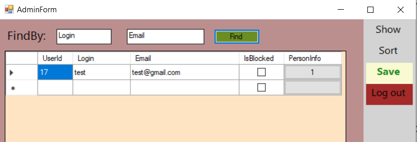

<!DOCTYPE html>
<html lang="en">
<head>
	<meta charset="UTF-8">
</head>
<body>
    

		<h1>Роль Administrator</h1>
		
Логується, попадає на стартову сторінку з можливістю перейти на сторінку своєї ролі за допомогою меню. 

		
Доступний перехід на адмін сторінку, на якій може бачити таблицю користувачів, активувати accounts користувачів або блокувати їх, робити пошук, сортувати.
 
		
В системі хоча б один адмін повинен бути. Може розлогуватися. Реалізувати названий функціонал.

	

	

	<h3>Основний функціонал:</h3>
	<ul>
		<li>Логування</li>
		<li>Стартова сторінка з меню</li>
		<li>Перехід на адмін сторінку</li>
		<ul>
			<li>таблиця користувачів</li>
			<li>заблокувати/розблокувати аккакнт</li>
			<li>пошук</li>
			<li>сортування</li>
		</ul>
		<li>Можливість розлогуватися</li>
	</ul>
	

	<h2>Думонстрація роботи WF</h2>
	
	
	
	
	
	
	
	
	
	
	
	
</body>
</html>
